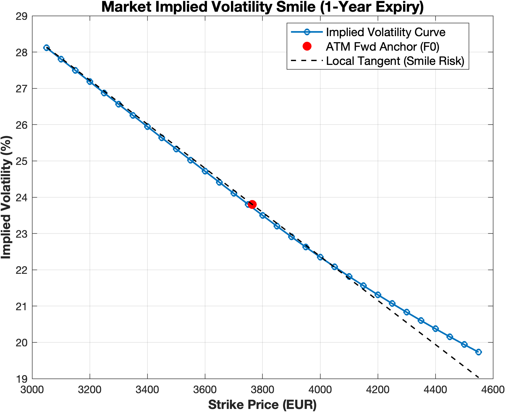
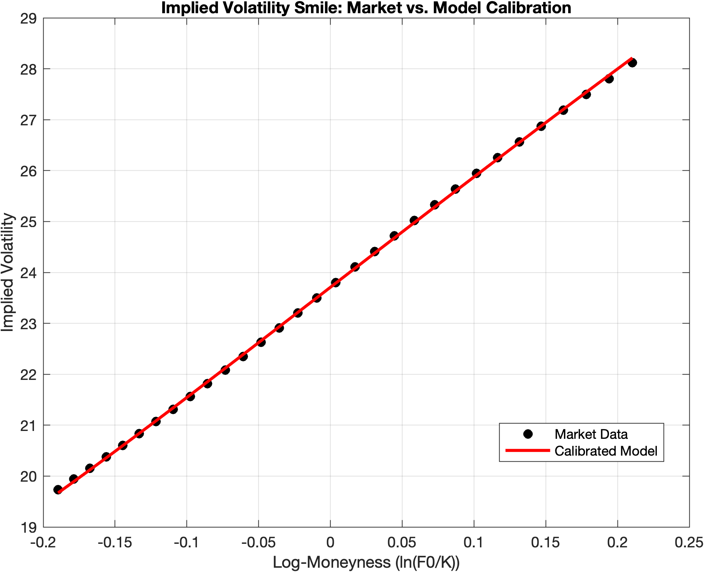

# Financial Engineering — Assignment 4

Option pricing under Lévy dynamics: closed-form / quadrature / FFT / Monte-Carlo
pricing from a given characteristic function, Normal Inverse Gaussian and Normal
Tempered Stable (mean-variance mixture) models, and calibration of an NTS model
to the EURO STOXX 50 implied volatility surface. Pure MATLAB.

Financial Engineering, MSc in Mathematical Engineering — Politecnico di
Milano, AY 2025/26. Individual solution.

---

## The exercises

| # | Topic |
|---|---|
| 1 | Equity Protection Certificate: upfront fee via moment-matching and Monte Carlo cross-check |
| 2 | Digital option pricing: flat-volatility Black vs. smile-adjusted (bull-spread limit) |
| 3 | Pricing under a given characteristic function (Double-Exponential): quadrature, FFT, analytical residues, direct & indirect Monte Carlo |
| 4 | Option pricing under NIG ($\alpha=1/2$) and the facultative NTS ($\alpha=1/3$) model, with an Inverse Gaussian moment diagnostic |
| 5 | Calibration of an NTS model ($\alpha=2/3$) to the EURO STOXX 50 implied volatility surface |

Full write-up of methodology, results and discussion in
[`Report.pdf`](Report.pdf).

## Selected results

| Exercise | Result |
|---|---|
| 1 — Certificate upfront | $X\%=9.9586\%$ (moment matching) vs. $9.9682\%$ (MC); MC standard error €8,991 confirms the €9,500 gap is simulation noise, not model error |
| 2 — Digital smile correction | €261,196 (smile-adjusted) vs. €217,618 (flat Black) — a 20% underestimation from ignoring the ATM skew |
| 3 — Double-Exponential pricing | Quadrature, FFT and analytical residues agree to $10^{-4}$–$10^{-6}$; direct Monte Carlo max error $1.09$ ($N_{sim}=10^7$) |
| 4 — NIG vs. NTS ($\alpha=1/3$) FFT accuracy | NIG FFT error $6.6\times10^{-4}$ vs. $\alpha=1/3$ error $3.73$ — over 1000× worse, from slower Fourier-domain tail decay |
| 5 — NTS surface calibration | $\hat\sigma=0.1374,\ \hat\kappa=0.2564,\ \hat\eta=25.21$ — model reproduces the same negative skew already found in Exercise 2 |

Two things worth flagging, because they are easy to miss:

**The $\alpha=1/3$ tail is expensive, not just "a smaller $\alpha$."** NIG
($\alpha=1/2$) and the facultative $\alpha=1/3$ model share the exact same FFT
grid, code path and $(\sigma,\kappa,\eta)$ parameters, yet the FFT-vs-Quadrature
error jumps from $6.6\times10^{-4}$ to $3.73$ — more than three orders of
magnitude. The reason is purely the characteristic function's tail:
$|\phi(u)|\sim\exp(-c|u|^{2\alpha})$ decays much more slowly for
$\alpha=1/3$, so more probability mass survives at high frequency and gets
truncated by a finite FFT grid tuned for NIG. Same machinery, wildly
different accuracy — the grid has to be tuned to the model's tail, not just
reused across the model family.

**One characteristic function, three "different" models.** Rather than
hard-coding the NIG closed form for Exercise 4 and a separate one for the
NTS calibration in Exercise 5, the characteristic exponent is implemented
once as a function of $\alpha$ and reused for NIG ($\alpha=1/2$), the
facultative case ($\alpha=1/3$) and the calibrated NTS model
($\alpha=2/3$) — three "different" models in the write-up are really one
formula evaluated at three points.



*Exercise 2 — Market implied volatility smile (1y, EURO STOXX 50). The
tangent's negative slope at the ATM point is exactly what pushes the
smile-adjusted digital price above the flat-Black price.*



*Exercise 5 — Calibrated NTS model ($\alpha=2/3$) vs. market smile. The fit
reproduces the same negative skew direction observed independently in
Exercise 2, on the same underlying.*

## Method notes (non-obvious choices)

- **Ex. 1** — the closed-form and Monte Carlo upfronts are reported side by
  side together with the MC standard error, specifically to validate the
  moment-matching approximation quantitatively rather than as a sanity
  check.
- **Ex. 3 (FFT)** — the FFT routine accepts either the log-moneyness grid
  spacing $x_1$ or the frequency-domain spacing $dz$ and derives the other
  automatically from the Nyquist relation $dx\cdot dz=2\pi/N$, instead of
  fixing both a priori.
- **Ex. 3 (indirect MC)** — the terminal log-return's CDF is reconstructed
  from FFT-priced digitals and validated against the empirical CDF of
  inverse-transform-sampled draws, rather than trusting the reconstruction
  blindly.
- **Ex. 4/5 (characteristic function)** — implemented as a single function
  of $\alpha$ (see flag above), not three hard-coded closed forms.
- **Ex. 4 (IG moment check)** — the Inverse Gaussian mixing variable's
  moments are validated by direct Monte Carlo comparison (theoretical vs.
  empirical mean/variance/skewness/kurtosis over $10^7$ draws) rather than
  by finite-differencing the characteristic function, which avoids the
  floating-point cancellation a 4th-order finite-difference stencil would
  suffer on the kurtosis.
- **Ex. 5 (implied vol inversion)** — implied vols are backed out with a
  vectorized `fsolve` solved in log-volatility space ($y=\log\sigma$,
  $\sigma=e^y$), which guarantees a strictly positive implied volatility by
  construction rather than by an externally imposed bound.

## Repository layout

```
runAssignment04_Group01.m   Entry point — Exercises 1, 2 and 5
runPricingFourierEx3.m      Entry point — Exercise 3 (Double-Exponential)
runPricingFourierEx4.m      Entry point — Exercise 4 (NIG / facultative alpha=1/3)
Ex_1/                        Exercise 1: certificate upfront (moment matching + MC)
Ex_2/                        Exercise 2: digital option, Black vs. smile-adjusted
Ex_3/                        Exercise 3: Lewis-formula pricing
  Ex_3.a)/                    Quadrature routines (trapezoidal, rectangular, QuadGK)
  Ex_3.b)/                    Analytical residues
  Ex_3.c)/                    FFT digital pricing, indirect MC, CDF reconstruction
  Ex_3.d)/                    Core FFT integral routine
Ex_4/                         Exercise 4: NIG pricing, IG moment diagnostic
Ex_5/                         Exercise 5: NTS calibration, implied vol inversion
Comparison/                   Cross-method diagnostics (FFT sensitivity, MC variety, ...)
Bootstrap/                    Zero-coupon curve bootstrapping utilities
figures/                      Figures referenced by this README and by the report
Report.pdf                    Full written report (methodology, results, discussion)
```

## Running it

```matlab
runAssignment04_Group01   % Exercises 1, 2, 5 — certificate, digital option, NTS calibration
runPricingFourierEx3      % Exercise 3 — Double-Exponential pricing
runPricingFourierEx4      % Exercise 4 — NIG pricing, alpha=1/3 facultative case
```

Each script adds all subfolders to the MATLAB path automatically
(`addpath(genpath(...))`), loads the required market data, and prints a
formatted report for each exercise to the console while producing the
relevant plots.

## Requirements

- MATLAB
- **Optimization Toolbox** — `fsolve` (implied-vol inversion, Ex. 5)
- **Statistics and Machine Learning Toolbox** — `normcdf`/`norminv` (Black-76 formulas)
- No Financial Toolbox required — `blsimpv` is deliberately not used (see method notes above)

## Author

Filippo Cuoghi
